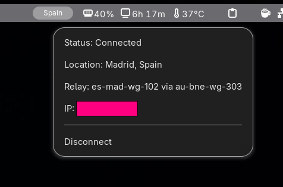

# Mullvad Indicator

Gnome shell extension that shows Mullvad VPN status in the top bar. 

## Features
- Live vpn status
- Server + location
- Connect / disconnect toggle

## Usage
- Click on the top bar icon to open the menu
- Press conncet/disconnect to toggle
- Status updates automatically


## installation
```bash
git clone https://github.com/vanhari/mullvad-indicator
cd mullvad-indicator
chmod +x install.sh
./install.sh
```
Then just restart the gnome shell by just logging out and back.


## Requirements
- Mullvad CLI installed
- Mullvad  •`_´•

## Screenshot



